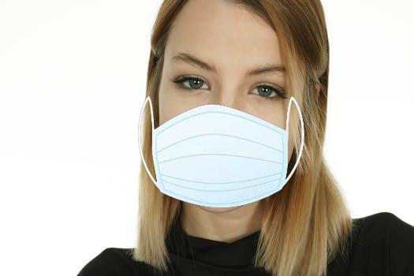

# Dataset
Ambos dataset tienen la misma estructura. Dos directorios: "Entrenamiento" y "Validacion", a su vez ambos directorios estan compuestos por otros dos directorios: "ConBarbijo" y "SinBarbijo". Como su nombre lo indica, el primer directorio "Entrenamiento" sirve para entrenar la red, mientras que el segundo "Validacion" sirve para hacer las validaciones despues de cada iteracion. 

La imagenes se obtuvieron de dos lugares:
* De un dataset previo desarrollado por "prajnasb". Quien usando imagenes de personas sin barbijo, con edicion añadio un barbijo a su rostro. De dicho dataset tome aproximadamente 400 imagenes. Si bien el dataset contaba con muchas mas imagenes, solo tome aquellas que no habian sido modificadas para aumentar el dataset (por ejemplo iamgenes que estaban rotadas o desplazadas). Ejemplo de la edicion:

* Imagenes sacadas de internet. Tanto de personas usando barbijo como de personas que no usan barbijo.

## Correcion de imagenes
Antes de comenzar el entrenamiento aplique un poco de edicion previa a las imagenes. Dichas ediciones se basaban principalemente en:
* Eliminar anuncios en las fotos. Ya que muchas fotos eran personas promocionando marcas de barbijos.
* Centrar la imagen en el rostro, ya que muchas imagenes eran de cuerpo completo.
* Algunas imagenes contenian a mas de una persona. Por lo que separaba a cada persona en una imagen individual, de esta manera aumentado poco a poco el tamaño del dataset.
* Eliminando imagenes que estuvieran repetidas.
* Eliminando imagenes que tuvieran muy mala calidad.

## Ampliacion del dataset
Para aumentar el tamaño del dataset, a la hora de entrenar se efectuaron varios cambios en cada imagen. Dichos cambios se efectuan durante el entrenamiento, por lo que en el dataset solo se encuentran imagenes sin estos cambios, solo las fotos originales.
Dichos cambios son:
* Dezplazamineto lateral, tanto a la derecha como a la izquierda.
* Zoom
* Invertir la imagen horizontalmente.
* Recortar partes de la imagen.

## ¿Porque dos dataset?
Si bien el primer dataset cuenta con mas imagenes, el problema era que este dataset contenia demasiadas imagenes en muy baja calidad, las cuales podrian contaminar el dataset, ademas de contener imagenes con personas que usaban barbijos con diseños y que no son reglamentarios para el uso dentro de espacios publicos. Es por eso que cree un segundo dataset, que si bien contiene menos imagenes, estas estan mejor seleccionadas, con persona usando solo barbijos reglamentarios y con imagenes en mejor calidad. Muchas imagenes del primer dataset se encuentran tambien en el segundo, pero su calidad es mucho mejor en el segundo.

## Caracteristicas datasetV1
* Imagenes entrenamiento gente con barbijo: 650
* Imagenes entrenamiento gente sin barbijo: 650
* Imagenes validacion gente con barbijo: 200
* Imagenes validacion gente sin barbijo: 200
* Total con barbijo: 850
* Total sin barbijo: 850
* Total imagenes: 1700

## Caracteristicas datasetV2
* Imagenes entrenamiento gente con barbijo: 484
* Imagenes entrenamiento gente sin barbijo: 484
* Imagenes validacion gente con barbijo: 150
* Imagenes validacion gente sin barbijo: 150
* Total con barbijo: 634
* Total sin barbijo: 634
* Total imagenes: 1268