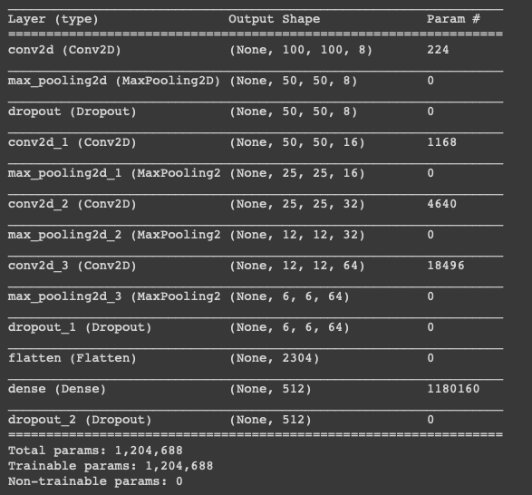
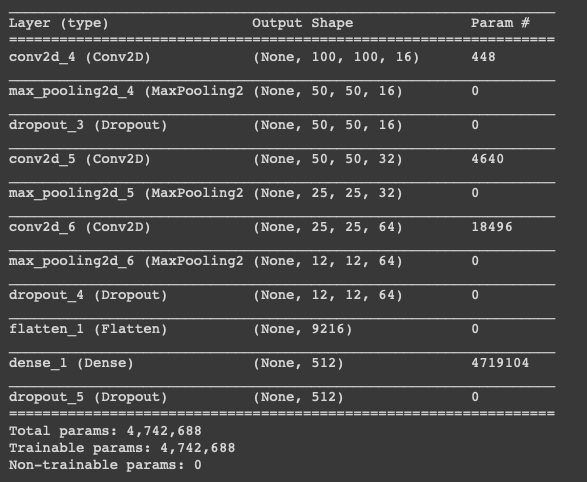

# Multiples entrenamientos para encontra la mejor red

Hice un total de 9 entrenamientos, variando distintos parametros, como ser: Numero de epocas, numero de pasos por epoca, numero de pasos de validacion y la estructura de la red.

Los resultados de cada red, como sus caracteristicas los muestro en la sigueinte tabla:

| Nº Modelo | Nº Epocas | Batch Size| Pasos  | Pasos Validacion | Estructura | % Precision |
|:---------:|:---------:|:---------:|:------:|:----------------:|:----------:|:-----------:|
|  Modelo 0 |    100    |    75     |   20   |        10        |   Primera  |   97.21     |     
|  Modelo 1 |    25     |    75     |   20   |        10        |   Primera  |   97.57     |  
|  Modelo 2 |    10     |    75     |   20   |        10        |   Primera  |   95.31     |  
|  Modelo 3 |    3      |    75     |   20   |        10        |   Primera  |   94.01     |  
|  Modelo 4 |    25     |    125    |   10   |        4         |   Primera  |   77.85     |  
|  Modelo 5 |    25     |    75     |   80   |        30        |   Primera  |   97.67     |  
|  Modelo 6 |    25     |    75     |   80   |        30        |   Segunda  |   98.87     |  
|  Modelo 7 |    10     |    75     |   80   |        30        |   Segunda  |   97.43     |  
|  Modelo 8 |    5      |    75     |   80   |        30        |   Segunda  |   97.00     |

## Primera estructura
La primera estructura cosnsistia de una red que comenzaba con una capa convolucional con 8 filtros, seguida de una capa de MaxPooling 2x2 y un Dropout de 20%. Este formato de convolucional, pooling se repitia 4 veces solo variando el numero de filtros (16,32 y 64). Para finalmente tener una capa densa con 512 neuronas, y una capa con funcion de activacion SoftMax para poder calsificar los resultados que contendra solo 2 neuronas.

## Primera estructura
La segunda estructura solo elimina la primera capa convolucional, la que contenia 8 filtros. y Mueve el dropout de justo despues de la capa convolucional que contiene 16 filtros, que ahora es la primera de la red.

## Resultados 
* La mejor estructura resulto ser la segunda, esto es posiblemente a que la primera estructura reducia demasiado el tamaño de la imagen al aplicar tantos filtros. 
* Con 80 pasos la red mostro mejores resultados que 20.
* El batch size que mostraba mejores resultados era de 75, ya que al aplicar 125 el modelo mostro menos prescision que todos los demas. 
* El numero de epocas que mejores resultados mostraba era cercano a los 20.
* El modelo que mas precision mostro fue el modelo 6. Este modelo es que aplica los cambios que mejores resultados mostraron. Las redes posteriores a esta fueron solo para veriricar si se podia encontrar mejores parametros, pero no mostraron mejores resultados.

## Notas
El modelo que se usa para las pruebas es el modelo 6 al ser el que mejores resultados mostro.
Cabe aclarar que estos no fueron los unicos modelos que cree. Cree mas de 30 modelos diferentes, variando parametros y la estructura de la red. Aca solo puse los modelos mas significativos, y que mostraban cierto progreso. Los modelos que fueron descartados fue porque tenian una precision demasiado baja o no representaban un cambio representativo para ser colocado en la tabla.