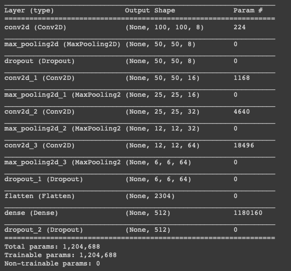
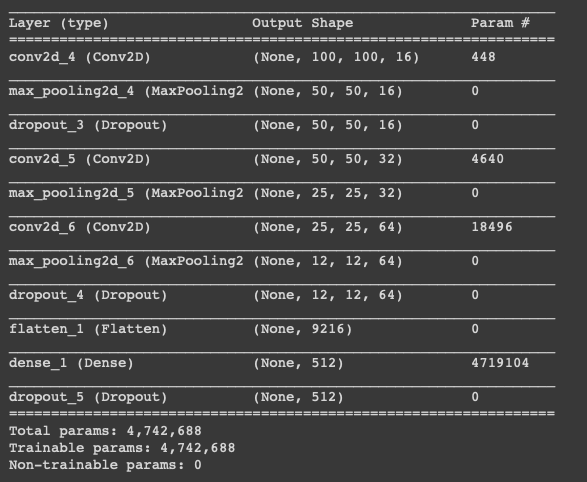
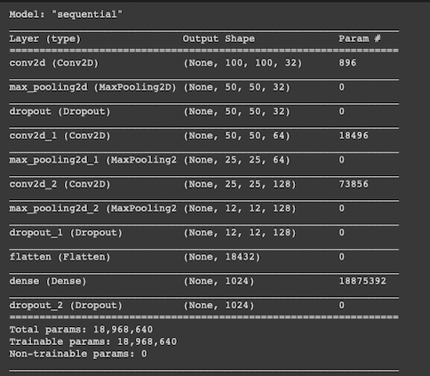

# Multiples entrenamientos para encontra la mejor red

Hice un total de 9 entrenamientos, variando distintos parametros, como ser: Numero de epocas, numero de pasos por epoca, numero de pasos de validacion y la estructura de la red.

Los resultados de cada red, como sus caracteristicas los muestro en la sigueinte tabla:

| Nº Modelo | Nº Epocas | Batch Size| Pasos  | Pasos Validacion | Estructura | % Precision |
|:---------:|:---------:|:---------:|:------:|:----------------:|:----------:|:-----------:|
|  Modelo 0 |    100    |    75     |   20   |        10        |   Primera  |   97.21     |     
|  Modelo 1 |    25     |    75     |   20   |        10        |   Primera  |   97.57     |  
|  Modelo 2 |    10     |    75     |   20   |        10        |   Primera  |   95.31     |  
|  Modelo 3 |    3      |    75     |   20   |        10        |   Primera  |   94.01     |  
|  Modelo 4 |    25     |    125    |   10   |        4         |   Primera  |   77.85     |  
|  Modelo 5 |    25     |    75     |   80   |        30        |   Primera  |   97.67     |  
|  Modelo 6 |    25     |    75     |   80   |        30        |   Segunda  |   98.87     |  
|  Modelo 7 |    10     |    75     |   80   |        30        |   Segunda  |   97.43     |  
|  Modelo 8 |    5      |    75     |   80   |        30        |   Segunda  |   97.00     |
|  ModeloV2 |    25     |    75     |   60   |        15        |   Segunda  |   98.93     |
| Modelo1V2 |    15     |    125    |   40   |        10        |   Segunda  |   98.43     |
| Modelo2V2 |    15     |    75     |   60   |        15        |   Tercera1 |   98.66     |
| Modelo3V2 |    15     |    75     |   60   |        15        |   Tercera2 |   99.64     |

## Primera estructura
La primera estructura cosnsistia de una red que comenzaba con una capa convolucional con 8 filtros, seguida de una capa de MaxPooling 2x2 y un Dropout de 20%. Este formato de convolucional, pooling se repitia 4 veces solo variando el numero de filtros (16,32 y 64). Para finalmente tener una capa densa con 512 neuronas, y una capa con funcion de activacion SoftMax para poder calsificar los resultados que contendra solo 2 neuronas.

## Segunda estructura
La segunda estructura solo elimina la primera capa convolucional, la que contenia 8 filtros. y Mueve el dropout de justo despues de la capa convolucional que contiene 16 filtros, que ahora es la primera de la red.

## Tercera estructura
En la primera version de esta estructura se reduce la cantidad de filtros en las cpas convolucionales y el numero de neuronas de la ultima capa densa a la mitad. En la segunda version de esta estructura se duplica el numero de filtros y neuronas.

## Diferencias entre los modelos v1 y v2
La diferencia entre ambos modelos es que los modelos de la version 1 fueron entrenados con el primer dataset, mientras que los modelos v2 fueron entrandos con la segunda version del dataset. El porque de dos dataset se explica en el directorio de los datasets.

## Mejor modelo
El mejor modelo fue el "modelo 6", era el que mostraba mas precision tanto en los datos, como en las pruebas manuales. Al ser la estructura que mejores resultados mostraba, entrene esta misma estructura pero con el nuevo dataset; el nuevo modelo originado fue mejor que el anterior al mostrar aun mas precision al usar un dataset mejorado. Es debido a esto que el modelo usado para la prueba en vivo es este. 

## Notas
Cabe aclarar que estos no fueron los unicos modelos que cree. Cree mas de 30 modelos diferentes, variando parametros y la estructura de la red. Aca solo puse los modelos mas significativos, y que mostraban cierto progreso. Los modelos que fueron descartados fue porque tenian una precision demasiado baja o no representaban un cambio representativo para ser colocado en la tabla.